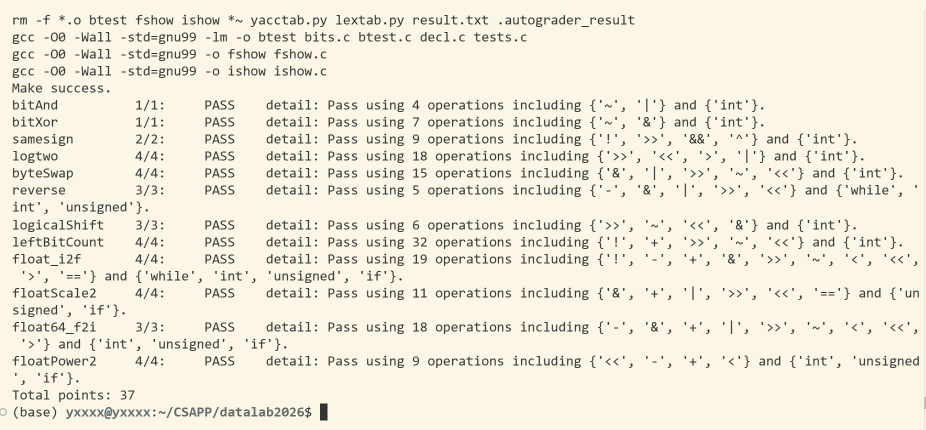

# datalab 报告

姓名：王奕萱

学号：2025201745

| 总分 | bitAnd | bitXor | samesign | logtwo | byteSwap | reverse |
| ---- | ------ | ------ | -------- | ------ | -------- | ------- |
| 37/37 | 1/1 | 1/1 | 2/2 | 4/4 | 4/4 | 3/3 |

| logicalShift | leftBitCount | float_i2f | floatScale2 | float64_f2i | floatPower2 |
| ------------ | ------------ | --------- | ----------- | ----------- | ----------- |
| 3/3 | 4/4 | 4/4 | 4/4 | 3/3 | 4/4 |

test 截图：



## 解题报告

### 亮点

logtwo 和 reverse 是我跟着 AI 学下来的，学会之后回头看，这两题我觉得最有亮点。logtwo 是相对最难的一道，一开始走的涂满那条路被运算符限制堵死了，换成二分之后又想了一版连大常量都不用的写法，两种我都实现了。reverse 那个分治的换法挺巧的，五轮依次交换相邻的 1、2、4、8、16 位就能把整个 32 位倒过来，比逐位搬漂亮，我也把它和循环版都写了一遍。

bitAnd 和 bitXor 的亮点在我自己理解的那一层。我是把 32 个位当成一个集合来看，`&` 是交集、`|` 是并集、`~` 是补集，这样德摩根律在集合和位运算两边说的就是同一件事，题目翻译过去就解开了。这个视角后面几道题也一直在用。

samesign、logicalShift、byteSwap 是完全靠自己的思路做出来的，从想法到实现到通过都没有再问别人。samesign 是想到符号位分不开 0 和正数之后，自己补上了 `!` 这一项；logicalShift 的掩码构造是自己推的，包括怎么绕开 n 取 0；byteSwap 的“取出、挖空、放回”三步也是自己想的。

下面按我做题的顺序讲，最后四道浮点题放在一起。

### bitAnd

这道题和下面的 bitXor 是我最先写的。我感觉把位运算和集合联系起来会好理解一点，就是把一个 int 的 32 个位看成一个全集里的 32 个元素，某一位是 1 就表示这个元素在集合里。这样 `&` 就是交集，`|` 是并集，`~` 是补集。

这题给的是 `~` 和 `|`，也就是补集和并集，而要拼出来的是交集。德摩根律正好干这个事，A ∩ B = ~(~A ∪ ~B)，直接翻译回位运算就是 `~(~x | ~y)`，四个运算符。

其实位运算本身也有德摩根律，可以不绕集合这一圈，但我绕一下自己想得更清楚。

### bitXor

还是用集合想。异或对应的是对称差，就是两个圆圈并起来那一整块，再把中间相交的那部分去掉。直接翻译过来就是 `x | y` 再减掉 `x & y`。集合的减法 A − B 就是 A ∩ ~B，翻译成位运算是先取反再与，所以整个写成 `(x | y) & ~(x & y)`。

这题不给 `|`，所以 `x | y` 那里再用一次德摩根换成 `~(~x & ~y)`，最后是

```c
return ~(~x & ~y) & ~(x & y);
```

四个 `~` 加三个 `&`，正好七个，卡在上限上。

我最开始写的不是这个版本。当时是 AI 提示我，可以从“异或取 1 有哪两种情形”入手的，一种是这一位 x 为 0、y 为 1，另一种反过来。这样很自然地会去分类讨论，拆成两种情况写出来是 `(~x & y) | (x & ~y)`，再用德摩根把 `|` 消掉，变成 `~(~(~x & y) & ~(x & ~y))`。这个结果是对的，但数一下是八个运算符，超了一个。怎么压到七个我自己没想出来，是问了 AI 才明白的，关键是别去分类讨论，改成“并集减交集”整体地看。

### samesign

符号这件事第一反应就是看符号位，所以先把 `x` 和 `y` 都右移 31 位。负数右移完是 −1，也就是 32 位全 1；0 和正数右移完都是 0。

问题就出在这儿：0 和正数的符号位是一样的，但题目把 0 单独算一类，光看符号位分不出来。所以还要再找一个能把 0 单独挑出来的东西，那就是 `!`，`!x` 只有在 `x` 为 0 的时候才是 1。

于是判据拆成两项，两项都成立才算同号：

```c
!((x >> 31) ^ (y >> 31))    /* 符号位相同 */
!((!x) ^ (!y))              /* 是不是 0 这件事也相同 */
```

负数的符号位恒为 1，所以第二项其实只在两个数符号位都是 0 的时候才起区分作用，正好把 `samesign(0, 1)` 和 `samesign(0, 0)` 分开。一共九个运算符。

### logicalShift

`x` 是 `int`，`x >> n` 是算术右移，`x` 为负数的时候高 n 位补的全是 1，而题目要的逻辑右移那里应该是 0。所以思路很直接，先算术右移，再想办法把高 n 位的 1 全部清掉。

清掉就是与上一个掩码，这个掩码要长成“高 n 位是 0，剩下的 32 − n 位是 1”。造这个掩码比较容易：

```c
return (x >> n) & ~(((1 << 31) >> n) << 1);
```

`1 << 31` 是只有最高位为 1，再算术右移 n 位，符号位会一路补过去，得到 n + 1 个高位 1。然后左移一位变成 n 个，取反就是要的掩码。

这里为什么要先造 n + 1 个再左移一位，而不是直接右移 n − 1 位造出 n 个，是因为 n 可以取 0，n − 1 就成了 −1，移位量为负属于未定义行为，绕这一下是为了躲开它。六个运算符，是这次写得最短的一题。

### byteSwap

这题我觉得挺直观的，三步：把要换的两个字节取出来，把它们原来的位置挖空，再交叉着放回去。

取出来的办法是先右移，把要的那个字节挪到最低的那一个字节的位置，然后和 `0xFF` 与一下就取出来了。第 n 个字节对应的移位量是 n 乘 8，这里写成 `n << 3`。

挖空用的还是 `0xFF`，只不过反着用：把 `0xFF` 左移到对应的位置去，两个位置或起来，再取个反。这样得到的掩码是“要挖的那两个字节的位置是 0，其他地方全是 1”，和 `x` 与一下，那两个字节就被清干净了，别的字节原样保留。

放回去就是把刚才取出来的两个字节各自左移到对方的位置，再或上去。

```c
int n8 = n << 3;
int m8 = m << 3;
int valueofn = (x >> n8) & 0xFF;
int valueofm = (x >> m8) & 0xFF;
int mask = ~((0xFF << n8) | (0xFF << m8));
return (x & mask) | (valueofn << m8) | (valueofm << n8);
```

取出来的时候那个 `& 0xFF` 还有一个附带的作用：`x` 如果是负数，右移是算术右移，高位会补一堆 1，`& 0xFF` 顺手就把它们切掉了。`n` 和 `m` 相等的时候，挖空和放回互相抵消，返回的就是 `x` 本身，所以这种情况可以不用特判。一共十五个运算符。

### reverse

要把 32 位整个倒过来。题目里写了可以用 `for` 和 `while`，那我就老老实实循环，一位一位地搬。

做法是另起一个 `result`，每次先左移一位腾出最低位，然后把 `v` 的最低位取出来装进去；`v` 那边取完就右移一位，把已经搬走的那位丢掉。这样循环 32 次，`v` 的最低位是第一个被搬走的，会一路被顶到 `result` 的最高位，正好就是倒序。

```c
unsigned result = 0;
int count = 32;
while (count) {
    result = (result << 1) | (v & 1);
    v = v >> 1;
    count = count - 1;
}
return result;
```

循环次数的控制这里有点小麻烦。这题给的运算符里没有 `<`，所以不能写 `count < 32`，改成让 `count` 从 32 往下减，用 `while (count)` 判断是不是已经减到 0 了。静态数运算符只有五个，离上限 30 很远。

AI 还给了一个分治的写法，就是不逐位搬，而是第一轮交换相邻的 1 位，第二轮交换相邻的 2 位，第三轮 4 位，第四轮 8 位，第五轮 16 位，五轮下来整个 32 位就倒过来了。思路上挺简洁的，就是写起来要配一串掩码，稍微麻烦一点。我也把它实现了一遍放在注释里。

### logtwo

这题要返回一个正整数以 2 为底的对数，向下取整。我一开始卡在读题上，后来 AI 给我梳理清楚了 `floor(log2(v))` 其实就是在问 `v` 的最高位 1 在第几位，这个转化一做题目就好办了。之前做原版 datalab 的时候有道题就是直接问最高位的，思路可以搬过来。

做那道题的时候我最先想的是课件上 bitCount 那一套，先把最高位以下的位全部涂成 1，也就是 `v |= v >> 1; v |= v >> 2; v |= v >> 4;` 这样一路涂下去，再数一共有多少个 1。但这题给的运算符只有 `> < >> << |`，涂满那一步是能做的，数 1 的个数那一步要靠一串 `&` 掩码，而 `&` 不在允许范围里，所以这条路走不通。

能走的是二分，就是一次确定答案的一个二进制位。答案最大是 31，只有五个二进制位，所以五轮就够了。

先问 `v` 是不是比 `0xFFFF` 大。是的话说明最高位 1 在第 16 位以上，答案的第 4 位（也就是 16 这一位）记 1，同时把 `v` 右移 16 位，把已经确定的那一半扔掉；不是的话这一位记 0，`v` 不动。接着拿 `0xFF` 问一遍，定答案的第 3 位（8）。再拿 `0xF`，定第 2 位（4）。再拿 `3`，定第 1 位（2）。四轮之后 `v` 只剩 1、2、3 三种可能，`v >> 1` 直接给出答案的第 0 位。

代码里 `move = (v > 0xFFFF) << 4` 这一句是把两件事合在一起写的。比较结果是 0 或 1，左移 4 位之后就变成了“这一轮该记 16 还是记 0”，而这个值同时也正好是“该把 `v` 右移多少位”。

还有个地方是累加。这题不给 `+`，但 16、8、4、2、1 占的是答案的五个不同的二进制位，彼此不重叠，所以用 `|` 拼起来和用 `+` 加起来结果是一样的。一共十八个运算符。

另外这里的大常量其实可以不用。判断 `v` 是不是比 `0xFFFF` 大，等价于问 `v >> 16` 是不是大于 0，因为 `v >> 16` 只要非零就说明 `v` 至少有 17 位。照这个思路把四轮比较全换掉，`0xFFFF`、`0xFF`、`0xF` 这些常量就都不需要了：

```c
int result, move;
move = ((v >> 16) > 0) << 4; v = v >> move; result = move;
move = ((v >> 8) > 0) << 3; v = v >> move; result = result | move;
move = ((v >> 4) > 0) << 2; v = v >> move; result = result | move;
move = ((v >> 2) > 0) << 1; v = v >> move; result = result | move;
return result | (v >> 1);
```

每一轮多了一次右移，所以运算符从十八个涨到二十一个，还在上限 25 以内。第一行直接写 `result = move` 而不是 `result = result | move`，因为 `result` 这时候还是 0，这样又省下一个。这一版我也实现了一遍，放在注释里。

这一题的二分思路和不用大常量的写法都是 AI 提示的，我自己一开始只想到涂满那条路。

### leftBitCount

这题要数从最高位开始连续有多少个 1，和 logtwo 一样是分治，我照着 logtwo 的骨架搬过来的。

先要一个判据，就是怎么判断 `x` 的高位是不是全 1。办法是看 `~x >> k` 这个式子：如果 `x` 的高位全是 1，那 `~x` 的高位就全是 0，再算术右移下来结果就是 0；反过来只要高位里有一个 0，`~x` 那边就有个 1，右移下来结果就非 0。所以 `!(~x >> k)` 就是在问“高 32 − k 位是不是全 1”。

有了判据就可以二分。先问高 16 位是不是全 1，是的话说明至少有 16 个，记下 16，然后把 `x` 左移 16 位，问题就变成在剩下的部分里接着数；不是的话这一轮记 0，`x` 不动。然后依次问 8、4、2、1，最后再补一次单个位的判断。

每一步长得都一样：

```c
step = (!(~x >> k)) << j;
count = count + step;
x = x << step;
```

这里和 logtwo 用的是同一个技巧，比较的结果左移之后，既是“这一轮该记多少”，也是“该把 `x` 左移多少位”。

计数的上界是 16 + 8 + 4 + 2 + 1 + 1 = 32，对应 `leftBitCount(-1)` 要返回 32，正好够用。一共三十二个运算符，上限是 50。

### 四道浮点题

最后四道我感觉是完全属于一类的，套路都一样：按 IEEE 754 的规矩把数拆成符号位、阶码 exp 和尾数 frac，然后对 exp 分类讨论，exp 全 1 是 Inf 或者 NaN，exp 全 0 是非规格化数，中间是规格化数，每一类按题目要求做对应的运算就行。难的地方基本都在边界那几类上。

#### float_i2f

要把一个 int 转成 float 的位表示。符号位直接取 `x` 的最高位；阶码和尾数来自 `|x|`，把最高位的那个 1 左移对齐到 bit31 之后阶码就定了。阶码初值取 158，也就是 127 + 31，对应“最高位本来就在 bit31”的情形，每往左移一位阶码就减一。

有两个地方要小心。一个是求绝对值：`x` 取 `INT_MIN` 的时候，`-x` 和在 int 里算 `~x + 1` 都是有符号溢出，属于未定义行为。所以我把 `x` 先赋给一个 `unsigned` 的 `frac`，在无符号域里算 `~frac + 1`，无符号的回绕是有定义的，算出来正好是 `0x80000000`，也就是 2³¹ 这个幅值。

另一个是舍入。float 只有 23 位尾数，移出去的低 8 位要按就近舍入、中间值取偶来处理，超过 128 进位，等于 128 时看当前尾数的奇偶，小于 128 就舍掉。最后一行用 `+` 拼接而不是 `|`，是因为尾数进位溢出成 `0x800000` 的时候，加法会自然地进到阶码字段上去。

#### floatScale2

乘 2 就是阶码加一，按 exp 分四类。exp 为 `0xFF` 是 Inf 或 NaN，题目说原样返回。exp 为 0 是非规格化数，尾数左移一位就行，这里不用另外判断进位，因为尾数的最高位左移之后正好落进阶码的最低位，得到的就是一个阶码为 1 的规格化数，本来就该是这个值。exp 为 `0xFE` 要单独拿出来，它翻倍之后溢出成 Inf；如果这一类也走 `uf + 0x800000`，阶码会变成 `0xFF` 而尾数原封不动，尾数只要带 1 结果就成了 NaN。剩下的情形阶码加一，即 `uf + 0x800000`。

#### float64_f2i

double 的 53 位尾数跨了两个 32 位字，高字 `uf2` 带 20 位，低字 `uf1` 带 32 位。记 E = exp − 1023，整数部分就是这 53 位尾数右移 52 − E 位。

E 小于 0 说明绝对值小于 1，向零截断就是 0。E 大于 30 是溢出，返回 `0x80000000`；Inf 和 NaN 的 exp 是 `0x7FF`，E 算出来是 1024，也落在这一支里。E 等于 31 的时候只有 −2³¹ 一个值是能表示的，而它的正确答案同样是 `0x80000000`，所以不用单独拎出来。

其余的情形要看 E 有没有超过 20。E 在 20 以内时整数部分全在高字里，`frac >> (20 - E)` 就够了；E 超过 20 时要把高字左移 E − 20 位，再拼上低字的高 E − 20 位。因为取的是幅值，右移天然就是向零截断，最后再按 `uf2` 的符号位决定要不要取负。

#### floatPower2

看 2.0ˣ 落在哪一段。x 在 128 以上阶码会超过 254，返回 `+INF`。x 在 −126 到 127 之间是规格化数，阶码 x + 127，尾数全 0。x 在 −149 到 −127 之间掉进非规格化区，这时候的值是 2⁻¹²⁶ × frac / 2²³，令它等于 2ˣ 解出 frac = `1 << (x + 149)`。x 比 −149 还小就已经比最小的非规格化数还小了，返回 0。

代码里三个 `if` 是从小到大排的，这样每一支只用比较上界，下界的比较由前一支承担。

## 反馈/收获/感悟/总结

好难好难好难。做之前先把原版 datalab 做了一遍，结果这版换了一大半题。两版断断续续花了一周。

做法是让 AI 先帮我把思路梳理清楚，我再自己手写一遍，这样强迫我把每一步都想明白。说实话完全靠自己是做不出来的，但做完确实学到了：原来基本都不会，现在至少会了，也能自己写出来，对各种位运算的理解深了不少。

想提一句 ddl。这次和小测撞在一起实在太紧，松一点我们应该能把该吃透的东西更有把握地吃透。

另外这份报告是我口述录音转文字、再让 AI 整理的，语言可能有点 AI 味，内容是我自己的。

## 参考的重要资料

-  伟大的 AI 老师
- 《深入理解计算机系统》
